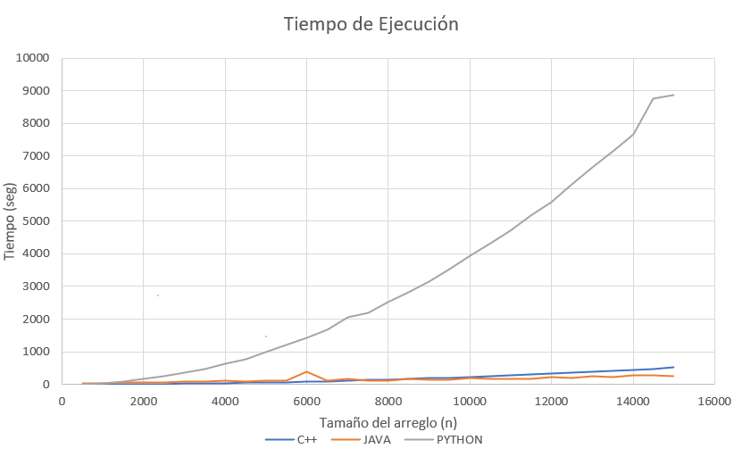

## Tiempo de Ejecución
El proyecto se centra en comparar los tiempos que le toman a diferentes lenguages de programación, tanto de alto como de bajo nivel, para ordenar algunos arreglos de diferentes tamaños usando el algoritmo del insertion sort.

### Experimentación
En esta se presentan los diferentes códigos ejecutados para el análisis de los datos de tiempo de ejecución.
### Características Maquina Virtual
* Ram -> 0.5 GB
* CPU -> 2.5GHz


## Generar Arreglos
RandomArrayWriter para crear los arreglos con diferentes tamaños y notar cambios en los tiempos de ejecución en cada uno de los lenguajes.
```markdown
import java.io.BufferedWriter;
import java.io.File;
import java.io.FileWriter;
import java.io.IOException;
import java.util.Random;

public class RandomArrayWriter {
    public static void main(String[] args) throws IOException {
        long size = Long.parseLong(args[0]);
        int min = Integer.parseInt(args[1]);
        int max = Integer.parseInt(args[2]);

        int[] array = new Random().ints(size, min, max).toArray();

        FileWriter fileWriter = new FileWriter(new File("./logs/array.txt"));
        BufferedWriter bufferedWriter = new BufferedWriter(fileWriter);

        for (int i : array) {
            bufferedWriter.write(Integer.toString(i));
            bufferedWriter.newLine();
        }
        bufferedWriter.close();
    }
}
```
A continuación se presenta los códigos usados en los diferentes lenguages para usar el insertion sort.
## Java
```markdown
import java.util.List;
import java.util.stream.Collectors;
import java.lang.StringBuilder;
import java.io.BufferedWriter;
import java.io.File;
import java.io.FileWriter;
import java.io.IOException;
import java.util.ArrayList;
import java.nio.file.Files;
import java.nio.file.Paths;

public class InsertionSort {
    public static void main(String[] args) throws IOException {
        List<Integer> array = Files.lines(Paths.get("./logs/array.txt"))
            .map(line -> Integer.valueOf(line))
            .collect(Collectors.toCollection(ArrayList::new));
        long time = sort(array);

        FileWriter fileWriter = new FileWriter(new File("./logs/java_sorted.txt"));
        BufferedWriter bufferedWriter = new BufferedWriter(fileWriter);
        for (Integer i : array) {
            bufferedWriter.write(i.toString());
            bufferedWriter.newLine();
        }
        bufferedWriter.close();

        BufferedWriter resultsWriter = new BufferedWriter(new FileWriter(
                    "results.md", true));
        resultsWriter.write(new StringBuilder().append("Java     | ")
                .append(Long.toString(time)).toString());
        resultsWriter.newLine();
        resultsWriter.close();
    }

    public static long sort(List<Integer> array) {
        long start = System.currentTimeMillis();
        int key;
        int j;
        int n = array.size();
        for (int i = 1; i < n; ++i) {
            key = array.get(i);
            j = i - 1;
            while (j >= 0 && array.get(j) > key) {
                array.set(j + 1, array.get(j));
                j--;
            }
            array.set(j + 1, key);
        }
        return System.currentTimeMillis() - start;
    }
}
```
## Python
```markdown

import time

def sort(arr):
    start = time.time_ns();
    for i in range(1, len(arr)):
        key = arr[i]
        j = i - 1
        while j >= 0 and key < arr[j]:
            arr[j + 1] = arr[j]
            j -= 1
        arr[j + 1] = key

    return (time.time_ns() - start) // 1e6


if __name__ == "__main__":
    with open("./logs/array.txt") as f:
        array = f.readlines()

    array = [int(x) for x in array]

    t = sort(array)

    with open("./logs/python-sorted.txt", "w") as f:
        for x in array:
            f.write(f"{str(x)}\n")

    with open("results.md", "a") as f:
        f.write(f"Python   | {str(round(t))}\n\n")
```
## CPP (C++)
```markdown
#include <iostream>
#include <fstream>
#include <vector>
#include <chrono>
using namespace std;

long long sort(vector<int> &arr) {
    auto start = chrono::system_clock::now();
    int j, key;
    int n = arr.size();
    for (int i = 1; i < n; i++) {
        key = arr[i];
        j = i - 1;

        while (j >= 0 && arr[j] > key) {
            arr[j + 1] = arr[j];
            j--;
        }
        arr[j + 1] = key;
    }
    auto end = chrono::system_clock::now();

    auto time = chrono::duration_cast<chrono::milliseconds>(end - start);
    return (long long) time.count();
}

int main(int argc, char** argv) {
    vector<int> array;

    ifstream ReadFile("./logs/array.txt");
    string line;
    while (getline (ReadFile,  line)) {
        array.push_back(stoi(line));
    }
    ReadFile.close();

    long long time = sort(array);

    ofstream WriteResults;
    WriteResults.open("results.md", ios_base::app);
    WriteResults << "C++      | " << to_string(time) << endl;
    WriteResults.close();

    ofstream WriteFile("./logs/cpp_sorted.txt");
    for (auto & i : array)
        WriteFile << to_string(i) << endl;
    WriteFile.close();

    return 0;
}
```
### Run in the Virtual Machine
Se codificó en el cmd de la maquina virtual la ejecución de cada uno de los algoritmos en los diferentes lenguajes, de modo que se puede generar un archivo de resultados con los tiempo de ejecución en milisegundos.
## Execution in CMD
```markdown
#!/bin/bash
if [ ! -f "counter.dat" ]; then
    COUNTER=0
    SIZE=0
    mkdir logs
else
    COUNTER=`cat counter.dat`
    SIZE=`cat size.dat`
    rm logs/*
    rm *.class
    rm a.out
fi

let COUNTER=COUNTER+1
echo "${COUNTER}" > counter.dat
let SIZE=SIZE+500
echo "${SIZE}" > size.dat
printf "# Test %d\n\n" $COUNTER >> results.md
MIN="-1000000"
MAX="1000001"
printf "Size of array: %d\n\nLower bound (inclusive): %d\n\nUpper bound (exclusive): %d\n\n" $SIZE $MIN $MAX >> results.md
echo "Language | Time in ms" >> results.md
echo "-------- | ----------" >> results.md
javac *.java
java RandomArrayWriter $SIZE $MIN $MAX
g++ InsertionSort.cpp
./a.out
java InsertionSort
python3 InsertionSort.py
```
## Resultados
<p align="center">
    
</p>

[Resultados de la ejecución de los algoritmos:](results.md)

