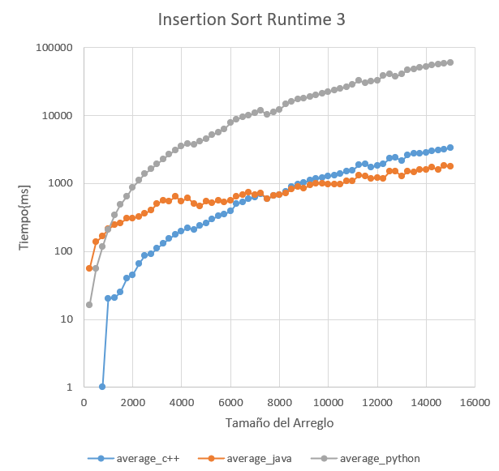

# Proyecto Final

## Integrantes

- Paúl Quimbita (00212513)
- Adrian Vásconez (00208899)

## Objetivos

- [x] Comparar el desempeño de tres lenguajes de programación de diferente naturaleza.
- [x] Implementar ordenamiento por inserción para arreglos dinámicos en tres lenguajes de programación diferentes.

## Experimentación

Se utilizó una máquina virtual de AWS para realizar las comparaciones con las siguientes características:

- Sistema operativo: Ubuntu 20.04 LTS
- Procesador: Intel(R) Xeon(R) CPU E5-2670 v2 @ 2.50GHz
- # de CPUs: 1
- Memoria: 0.5 GB

Para los tests, se generaron arreglos de números aleatorios en Java:

```markdown
import java.io.BufferedWriter;
import java.io.File;
import java.io.FileWriter;
import java.io.IOException;
import java.util.Random;

public class RandomArrayWriter {
public static void main(String[] args) throws IOException {
long size = Long.parseLong(args[0]);
int min = Integer.parseInt(args[1]);
int max = Integer.parseInt(args[2]);

        int[] array = new Random().ints(size, min, max).toArray();

        FileWriter fileWriter = new FileWriter(new File("./logs/array.txt"));
        BufferedWriter bufferedWriter = new BufferedWriter(fileWriter);

        for (int i : array) {
            bufferedWriter.write(Integer.toString(i));
            bufferedWriter.newLine();
        }
        bufferedWriter.close();
    }

}
```

Este código escribe el arreglo en un archivo que es leído por el programa de cada lenguaje. Se utilizaron los códigos siguientes para medir el desempeño durante el proceso de ordenamiento por inserción.

### C++

```markdown
#include <iostream>
#include <fstream>
#include <vector>
#include <chrono>
using namespace std;

long long sort(vector<int> &arr) {
auto start = chrono::system_clock::now();
int j, key;
int n = arr.size();
for (int i = 1; i < n; i++) {
key = arr[i];
j = i - 1;

        while (j >= 0 && arr[j] > key) {
            arr[j + 1] = arr[j];
            j--;
        }
        arr[j + 1] = key;
    }
    auto end = chrono::system_clock::now();

    auto time = chrono::duration_cast<chrono::milliseconds>(end - start);
    return (long long) time.count();

}

int main(int argc, char\*\* argv) {
vector<int> array;

    ifstream ReadFile("./logs/array.txt");
    string line;
    while (getline (ReadFile,  line)) {
        array.push_back(stoi(line));
    }
    ReadFile.close();

    long long time = sort(array);

    ofstream WriteResults;
    WriteResults.open("results.md", ios_base::app);
    WriteResults << "C++      | " << to_string(time) << endl;
    WriteResults.close();

    ofstream WriteFile("./logs/cpp_sorted.txt");
    for (auto & i : array)
        WriteFile << to_string(i) << endl;
    WriteFile.close();

    return 0;

}
```

### Java

```markdown
import java.util.List;
import java.util.stream.Collectors;
import java.lang.StringBuilder;
import java.io.BufferedWriter;
import java.io.File;
import java.io.FileWriter;
import java.io.IOException;
import java.util.ArrayList;
import java.nio.file.Files;
import java.nio.file.Paths;

public class InsertionSort {
public static void main(String[] args) throws IOException {
List<Integer> array = Files.lines(Paths.get("./logs/array.txt"))
.map(line -> Integer.valueOf(line))
.collect(Collectors.toCollection(ArrayList::new));
long time = sort(array);

        FileWriter fileWriter = new FileWriter(new File("./logs/java_sorted.txt"));
        BufferedWriter bufferedWriter = new BufferedWriter(fileWriter);
        for (Integer i : array) {
            bufferedWriter.write(i.toString());
            bufferedWriter.newLine();
        }
        bufferedWriter.close();

        BufferedWriter resultsWriter = new BufferedWriter(new FileWriter(
                    "results.md", true));
        resultsWriter.write(new StringBuilder().append("Java     | ")
                .append(Long.toString(time)).toString());
        resultsWriter.newLine();
        resultsWriter.close();
    }

    public static long sort(List<Integer> array) {
        long start = System.currentTimeMillis();
        int key;
        int j;
        int n = array.size();
        for (int i = 1; i < n; ++i) {
            key = array.get(i);
            j = i - 1;
            while (j >= 0 && array.get(j) > key) {
                array.set(j + 1, array.get(j));
                j--;
            }
            array.set(j + 1, key);
        }
        return System.currentTimeMillis() - start;
    }

}
```

### Python

```markdown
import time

def sort(arr):
start = time.time_ns();
for i in range(1, len(arr)):
key = arr[i]
j = i - 1
while j >= 0 and key < arr[j]:
arr[j + 1] = arr[j]
j -= 1
arr[j + 1] = key

    return (time.time_ns() - start) // 1e6

if **name** == "**main**":
with open("./logs/array.txt") as f:
array = f.readlines()

    array = [int(x) for x in array]

    t = sort(array)

    with open("./logs/python-sorted.txt", "w") as f:
        for x in array:
            f.write(f"{str(x)}\n")

    with open("results.md", "a") as f:
        f.write(f"Python   | {str(round(t))}\n\n")
```

Nótese que en estos programas, solamente se toma en cuenta el tiempo de ordenamiento en sí, y no el de lectura de los archivos. Además, se procuró utilizar la librería por defecto que implemente el paradigma de un arreglo dinámico.

Para correr los tests, se utilizó el siguiente script de bash:

```markdown
#!/bin/bash
if [ ! -f "counter.dat" ]; then
COUNTER=0
SIZE=0
mkdir logs
else
COUNTER=`cat counter.dat`
SIZE=`cat size.dat`
rm logs/_
rm _.class
rm a.out
fi

let COUNTER=COUNTER+1
echo "${COUNTER}" > counter.dat
let SIZE=SIZE+500
echo "${SIZE}" > size.dat
printf "# Test %d\n\n" $COUNTER >> results.md
MIN="-1000000"
MAX="1000001"
printf "Size of array: %d\n\nLower bound (inclusive): %d\n\nUpper bound (exclusive): %d\n\n" $SIZE $MIN $MAX >> results.md
echo "Language | Time in ms" >> results.md
echo "-------- | ----------" >> results.md
javac \*.java
java RandomArrayWriter $SIZE $MIN $MAX
g++ InsertionSort.cpp
./a.out
java InsertionSort
python3 InsertionSort.py
```

De esta forma, se obtuvieron [datos](https://andresquimbita.github.io/ProyectoOrganizacion/results.html) en el formato de tabla.

_En el link de arriba, cámbiale el título para que diga: "Resultados en Tablas" en lugar de "ProyectoOrganizacion"_

Además, se decidió realizar un gráfico comparativo de los resultados. Para este efecto, decidimos realizar varios tests con los mismos valores para poder sacar un promedio y obtener un mejor gráfico. Se realizaron 10 tests con diferentes arreglos aleatorios para cada tamaño de arreglo.

Se utilizaron los siguientes scripts de bash para obtener los datos.

```markdown
#!/bin/bash
rm -f -R data
mkdir data
for j in {1..10}; do
echo Running full test \#$j...
	./full_test
	filename="./data/full_test_results$j.csv"
cp full_test_results.csv $filename
done
```

```markdown
#!/bin/bash
SIZE=250
MIN="-1000000"
MAX="1000001"
./reset*test
echo "array_size,c++\_time,java_time,python_time" > full_test_results.csv
mkdir logs
javac *.java
g++ -o InsertionSort.out InsertionSort.cpp
for i in {1..60}; do
echo Sorting array of $SIZE entries...
rm -f logs/\_
printf "%d," $SIZE >> full_test_results.csv
java RandomArrayWriter $SIZE $MIN $MAX
let SIZE=SIZE+250
./InsertionSort.out
java InsertionSort
python3 InsertionSort.py
echo $i/60 done.
done
```

Al obtener los datos, nos dimos cuenta de que no se apreciaban bien debido a que había una gran diferencia entre los diferentes códigos. Por lo tanto, decidimos usar una escala logarítmica. Además, curiosamente nos dimos cuenta de que alrededor de la marca de las 8000 entradas, C++ parecía ser superado por Java. Por lo tanto, decidimos aumentar el número de entradas máximo y repetimos los tests.

### Runtime 1

<p align="center">
    
</p>

[Resultados de la ejecución de los algoritmos 1.](results.md)

**runtime 2 con etiquetas de los ejes y con diferente título. Eje y: "Tiempo [ms]". Eje x: "Tamaño del arreglo".**

### Runtime 2

<p align="center">
    
</p>

[Resultados de la ejecución de los algoritmos 2.](https://github.com/adricamilo/cmp-3004-final/tree/main/graph_test/data_ec2_2)

**runtime 3 con etiquetas de los ejes y con diferente título. Eje y: "Tiempo [ms]". Eje x: "Tamaño del arreglo".**

### Runtime 3

<p align="center">
    
</p>

[Resultados de la ejecución de los algoritmos 3.](https://github.com/adricamilo/cmp-3004-final/tree/main/graph_test/data_ec2_1)

Podemos observar que la tendencia continúo al aumentar el número de entradas del arreglo.

## Análisis

Los resultados en general confirmar lo que esperábamos. Python, al ser un lenguaje interpretado, es mucho más lento que lenguajes compilados como C++ o Java, debido a que cada instrucción debe ser interpretada para ser corrida. Sin embargo, nos parece importante resaltar el comportamiento de C++ vs. Java.

Debido a que Java utiliza una máquina virtual para ejecutarse, esperábamos que su desempeño siempre fuera mejor al de C++. Sin embargo, esto solo ocurre para un número de entradas menor a 8000 aproximadamente. Pasado este punto, C++ empieza a demorarse más que Java, si bien la diferencia entre estos es mucho menor a la diferencia con Python.

Creemos que las optimizaciones de la máquina virtual de Java son responsables por esta diferencia, debido a un mejor manejo de la memoria que permite que su desempeño sea mejor. Esto también se apoya si consideramos los valores de tiempo de C++ para pocos datos. El tiempo de ordenamiento para pocos datos en C++ es virtualmente inexistente, sin embargo al aumentarse el número de datos, el manejo de memoria deficiente termina siendo más importante para la ejecución del programa.

## Enlace a repositorio del proyecto

[GitHub repo](https://github.com/adricamilo/cmp-3004-final)
